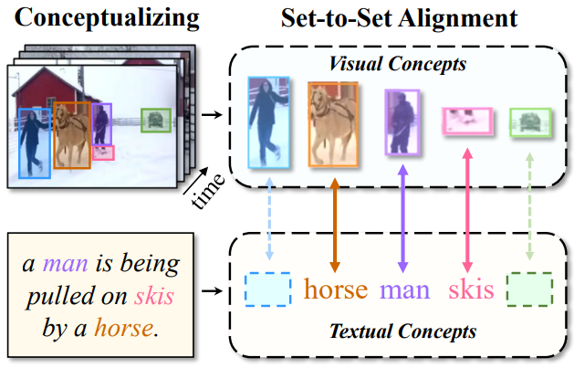
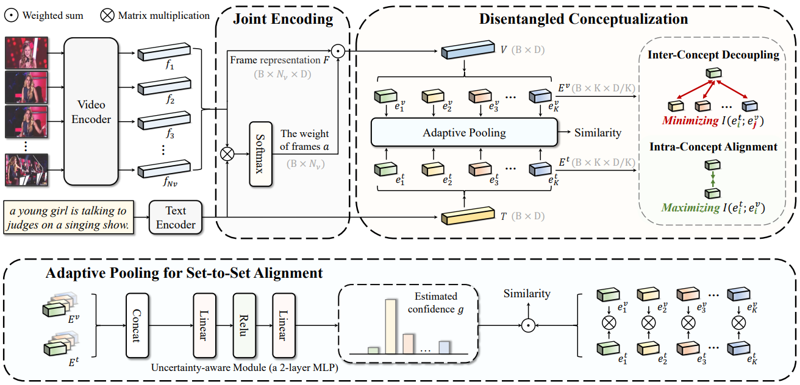

<div align="center">
  
# 【IJCAI'2023 🔥】Text-Video Retrieval with Disentangled Conceptualization and Set-to-Set Alignment
  
[](https://ijcai-23.org/)
[]()
</div>

The implementation of IJCAI 2023 paper [Text-Video Retrieval with Disentangled Conceptualization and Set-to-Set Alignment]().

## 📌 Citation
If you find this paper useful, please consider staring 🌟 this repo and citing 📑 our paper:
```
@inproceedings{
jin2023text,
title={Text-Video Retrieval with Disentangled Conceptualization and Set-to-Set Alignment},
author={Peng Jin and Hao Li and Zesen Cheng and Jinfa Huang and Zhennan Wang and Li Yuan and Chang Liu and Jie Chen},
booktitle={IJCAI},
year={2023}
}
```

## 📣 Updates
* Apr 30 2023: Release code for reimplementing the experiments in the paper.

## 📕 Overview
Text-video retrieval is a challenging cross-modal task, which aims to align visual entities with natural language descriptions.
Current methods either fail to leverage the local details or are computationally expensive.
What’s worse, they fail to leverage the heterogeneous concepts in data. 
In this paper, we propose the Disentangled Conceptualization and Set-to-set Alignment (DiCoSA) to simulate the conceptualizing and reasoning process of human beings.
For disentangled conceptualization, we divide the coarse feature into multiple latent factors related to semantic concepts.
For set-to-set alignment, where a set of visual concepts correspond to a set of textual concepts, we propose an adaptive pooling method to aggregate semantic concepts to address the partial matching.

<div align="center">

</div>

## 📚 Method

<div align="center">

</div>


## 🚀 Quick Start
<details>
<summary><b>Text-video Retrieval</b></summary>

### Setup code environment
```shell
conda create -n DiCoSA python=3.9
conda activate DiCoSA
pip install -r requirements.txt
pip install torch==1.8.1+cu102 torchvision==0.9.1+cu102 -f https://download.pytorch.org/whl/torch_stable.html
```

### Download CLIP Model

```shell
cd tvr/models
wget https://openaipublic.azureedge.net/clip/models/40d365715913c9da98579312b702a82c18be219cc2a73407c4526f58eba950af/ViT-B-32.pt
# wget https://openaipublic.azureedge.net/clip/models/5806e77cd80f8b59890b7e101eabd078d9fb84e6937f9e85e4ecb61988df416f/ViT-B-16.pt
# wget https://openaipublic.azureedge.net/clip/models/b8cca3fd41ae0c99ba7e8951adf17d267cdb84cd88be6f7c2e0eca1737a03836/ViT-L-14.pt
```


### Download Datasets

#### MSRVTT
For MSRVTT, the official data and video links can be found in [link](http://ms-multimedia-challenge.com/2017/dataset).

For the convenience, the splits and captions can be found in sharing from [CLIP4Clip](https://github.com/ArrowLuo/CLIP4Clip/),

```shell
wget https://github.com/ArrowLuo/CLIP4Clip/releases/download/v0.0/msrvtt_data.zip
```

Besides, the raw videos can be found in sharing from [Frozen in Time](https://github.com/m-bain/frozen-in-time), i.e.,

```shell
wget https://www.robots.ox.ac.uk/~maxbain/frozen-in-time/data/MSRVTT.zip
```

#### MSVD

For MSDC, the official data and video links can be found in [link](https://www.cs.utexas.edu/users/ml/clamp/videoDescription/).

For convenience, we share the processed dataset in [link](https://disk.pku.edu.cn:443/link/CC02BD15907BFFF63E5AAE4BF353A202).

```shell
https://disk.pku.edu.cn:443/link/CC02BD15907BFFF63E5AAE4BF353A202
```

#### LSMDC

For LSMDC, the official data and video links can be found in [link](https://sites.google.com/site/describingmovies/).

Due to license restrictions, we cannot share this dataset.

#### ActivityNet Captions

For ActivityNet Captions, the official data and video links can be found in [link](https://cs.stanford.edu/people/ranjaykrishna/densevid/).

For convenience, we share the processed dataset in [link](https://disk.pku.edu.cn:443/link/83351ABDAEA4A17A5A139B799BB524AC).

```shell
https://disk.pku.edu.cn:443/link/83351ABDAEA4A17A5A139B799BB524AC
```

#### DiDeMo

For DiDeMo, the official data and video links can be found in [link](https://github.com/lisaanne/localizingmoments).

For convenience, we share the processed dataset in [link](https://disk.pku.edu.cn:443/link/BBF9F5990FC4D7FD5EA9777C32901E62).

```shell
https://disk.pku.edu.cn:443/link/BBF9F5990FC4D7FD5EA9777C32901E62
```

### Compress Video
```sh
python preprocess/compress_video.py --input_root [raw_video_path] --output_root [compressed_video_path]
```
This script will compress the video to *3fps* with width *224* (or height *224*). Modify the variables for your customization.


### Test on MSR-VTT
The checkpoint can be downloaded from [pytorch_model.bin.msrvtt](https://disk.pku.edu.cn:443/link/16E6BA590227B4580B99AC501C2586B1).
```shell
CUDA_VISIBLE_DEVICES=0,1,2,3,4,5,6,7 \
python -m torch.distributed.launch \
--master_port 2502 \
--nproc_per_node=8 \
main_retrieval.py \
--do_eval 1 \
--workers 8 \
--n_display 50 \
--epochs 5 \
--lr 1e-4 \
--coef_lr 1e-3 \
--batch_size 128 \
--batch_size_val 128 \
--anno_path data/MSR-VTT/anns \
--video_path ${DATA_PATH}/MSRVTT_Videos \
--datatype msrvtt \
--max_words 32 \
--max_frames 12 \
--video_framerate 1 \
--output_dir ${OUTPUT_PATH} \
--center 8 \
--temp 3 \
--alpha 0.01 \
--beta 0.005 \
--init_model pytorch_model.bin.msrvtt
```

###  Train on MSR-VTT
```shell
CUDA_VISIBLE_DEVICES=0,1,2,3,4,5,6,7 \
python -m torch.distributed.launch \
--master_port 2502 \
--nproc_per_node=8 \
main_retrieval.py \
--do_train 1 \
--workers 8 \
--n_display 50 \
--epochs 5 \
--lr 1e-4 \
--coef_lr 1e-3 \
--batch_size 128 \
--batch_size_val 128 \
--anno_path data/MSR-VTT/anns \
--video_path ${DATA_PATH}/MSRVTT_Videos \
--datatype msrvtt \
--max_words 32 \
--max_frames 12 \
--video_framerate 1 \
--output_dir ${OUTPUT_PATH} \
--center 8 \
--temp 3 \
--alpha 0.01 \
--beta 0.005
```

###  Train on LSMDC
```shell
CUDA_VISIBLE_DEVICES=0,1,2,3,4,5,6,7 \
python -m torch.distributed.launch \
--master_port 2502 \
--nproc_per_node=8 \
main_retrieval.py \
--do_train 1 \
--workers 8 \
--n_display 5 \
--epochs 5 \
--lr 1e-4 \
--coef_lr 1e-3 \
--batch_size 128 \
--batch_size_val 128 \
--anno_path ${Anno_PATH} \
--video_path ${DATA_PATH} \
--datatype lsmdc \
--max_words 32 \
--max_frames 12 \
--video_framerate 1 \
--output_dir ${OUTPUT_PATH} \
--center 8 \
--temp 3 \
--alpha 0.01 \
--beta 0.005
```

###  Train on ActivityNet Captions
```shell
CUDA_VISIBLE_DEVICES=0,1,2,3,4,5,6,7 \
python -m torch.distributed.launch \
--master_port 2502 \
--nproc_per_node=8 \
main_retrieval.py \
--do_train 1 \
--workers 8 \
--n_display 50 \
--epochs 5 \
--lr 1e-4 \
--coef_lr 1e-3 \
--batch_size 128 \
--batch_size_val 128 \
--anno_path ${Anno_PATH} \
--video_path ${DATA_PATH} \
--datatype activity \
--max_words 64 \
--max_frames 64 \
--video_framerate 1 \
--output_dir ${OUTPUT_PATH} \
--center 8 \
--temp 3 \
--alpha 0.01 \
--beta 0.005
```

###  Train on DiDeMo
```shell
CUDA_VISIBLE_DEVICES=0,1,2,3,4,5,6,7 \
python -m torch.distributed.launch \
--master_port 2502 \
--nproc_per_node=8 \
main_retrieval.py \
--do_train 1 \
--workers 8 \
--n_display 50 \
--epochs 5 \
--lr 1e-4 \
--coef_lr 1e-3 \
--batch_size 128 \
--batch_size_val 128 \
--anno_path ${Anno_PATH} \
--video_path ${DATA_PATH} \
--datatype didemo \
--max_words 64 \
--max_frames 64 \
--video_framerate 1 \
--output_dir ${OUTPUT_PATH} \
--center 8 \
--temp 3 \
--alpha 0.01 \
--beta 0.005
```
</details>

## 🎗️ Acknowledgments
* This code implementation are adopted from [CLIP](https://github.com/openai/CLIP), [DRL](https://github.com/foolwood/DRL), and [EMCL](https://github.com/jpthu17/EMCL).
We sincerely appreciate for their contributions.
